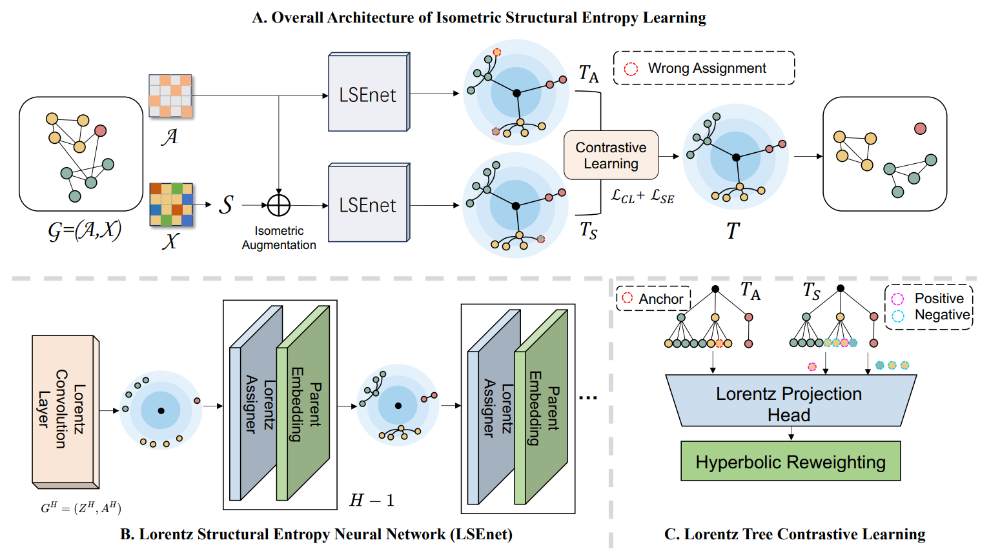
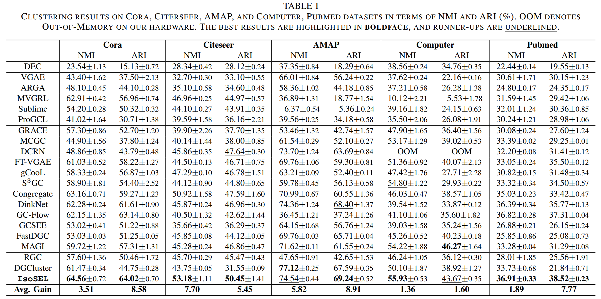
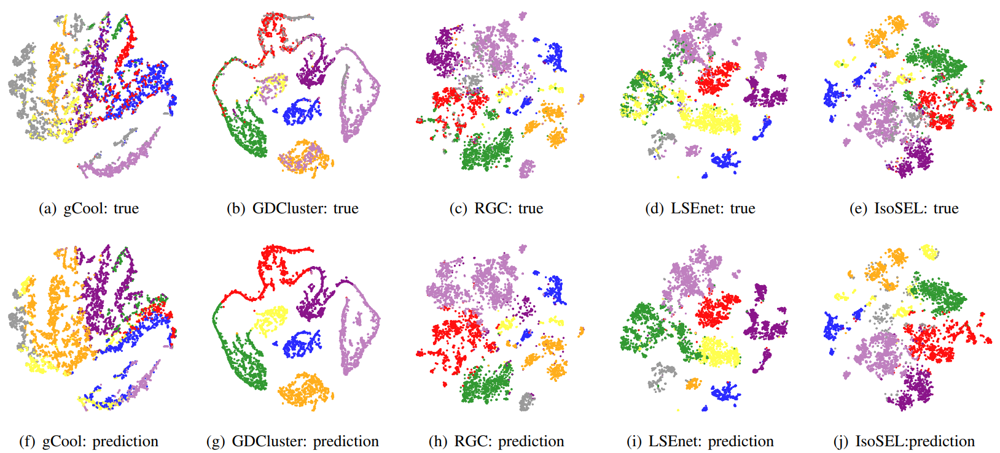
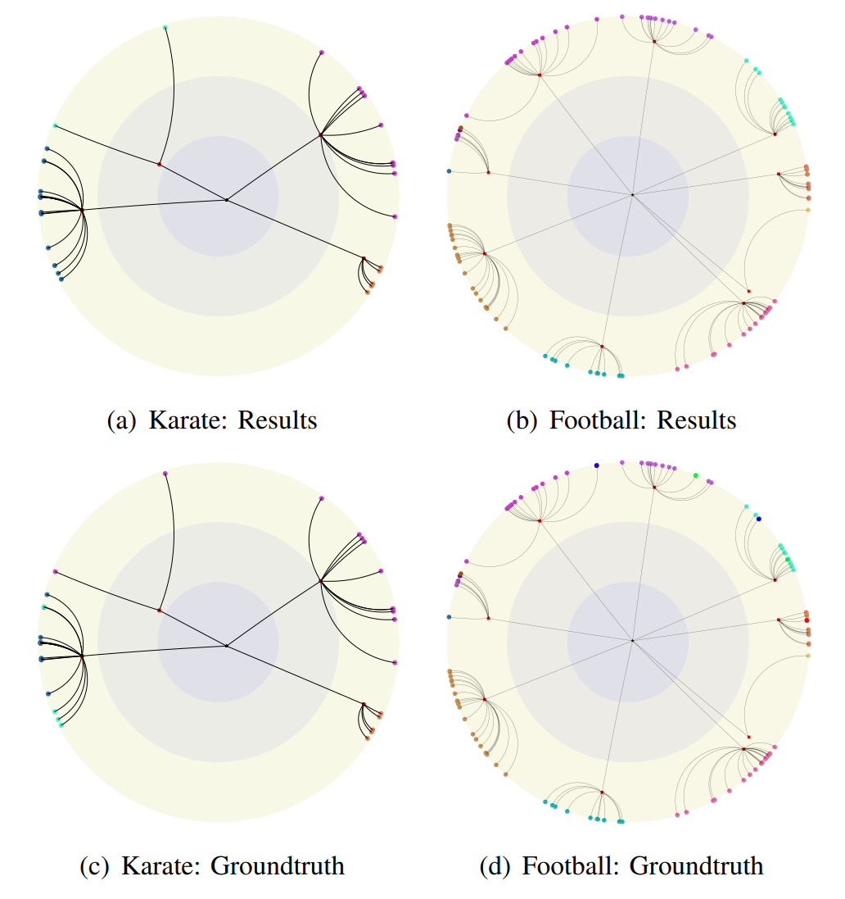

# LSEnet: Lorentz Structural Entropy Neural Network for Deep Graph Clustering

[ICML2024 (**Oral**)]: LSEnet: Lorentz Structural Entropy Neural Network for Deep Graph Clustering.

**The latest codes** and **the further research** about graph structural entropy have moved to the new repository.

Please refer to [https://github.com/RiemannGraph/DSE_clustering](https://github.com/RiemannGraph/DSE_clustering).

## Model Architecture

Figure 1. In *IsoSEL*, we learn the partitioning tree of structural information with the *LSEnet* in hyperbolic space, and then propose Lorentz tree contrastive
learning to refine the partitioning tree for graph clustering without K.

## Main Experimental Results

## Visualization

Figure 2. Visualization of real and predicted data.

  

Figure 2. Visualization of hyperbolic partitioning trees.

