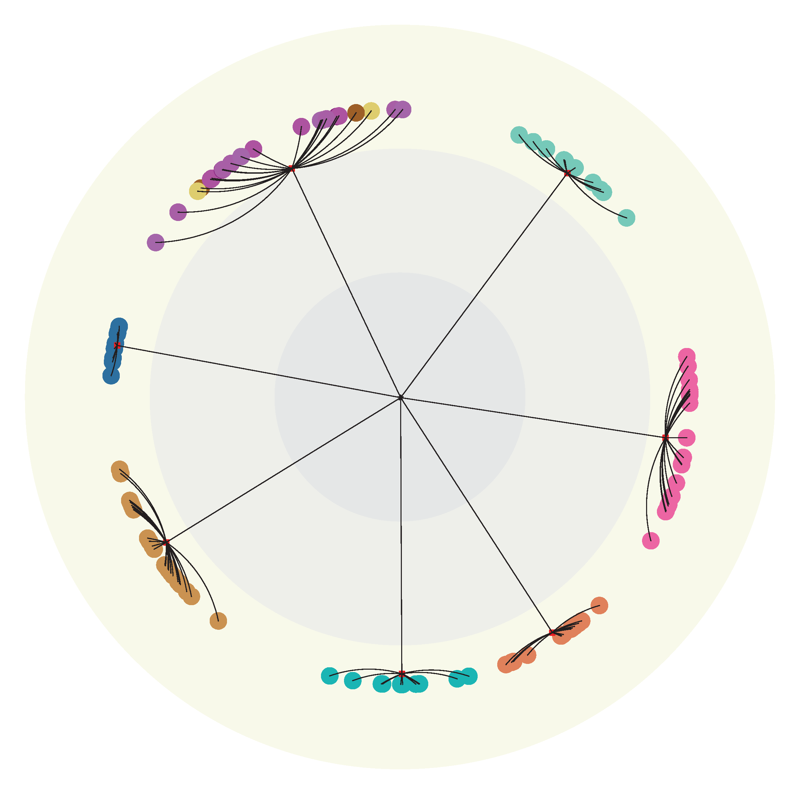
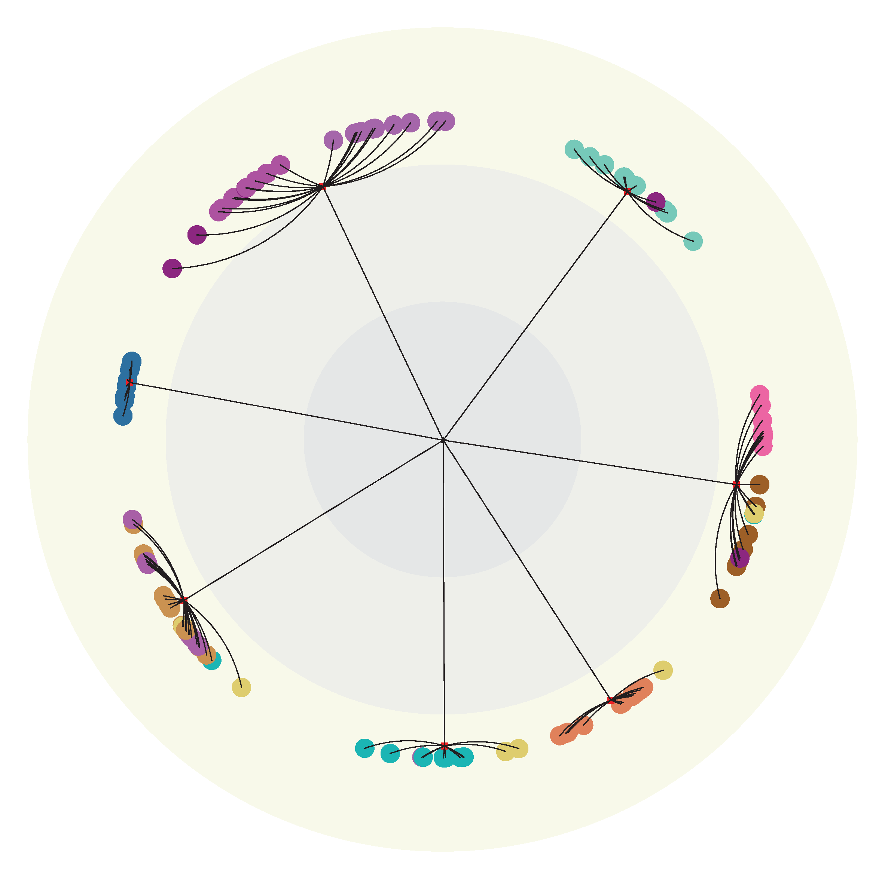

# LSEnet

LSEnet: Lorentz Structural Entropy Neural Network for Deep Graph Clustering.

## Get Started

```bash
cd ./LSEnet
python main.py
```

## Visualization

<div align=center>

</div>
<div align=center>
Figure 1. Prediction results on FootBall dataset.
</div>
<br><br>
<div align=center>

</div>
<div align=center>
Figure 2. True labels of FootBall dataset.
</div>
